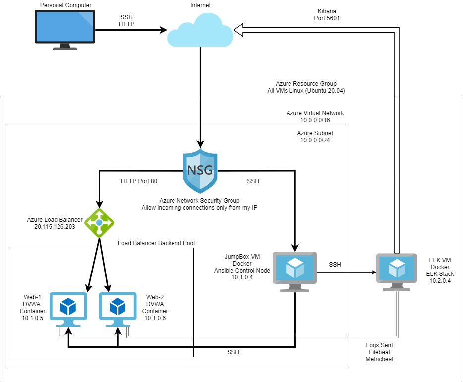
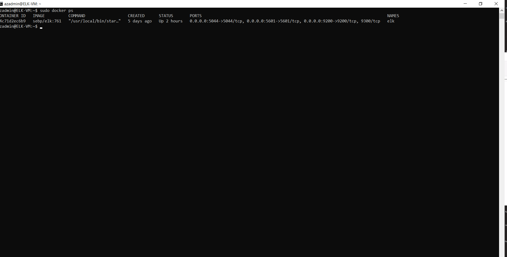

## Automated ELK Stack Deployment

The files in this repository were used to configure the network depicted below.

These files have been tested and used to generate a live ELK deployment on Azure. They can be used to recreate the entire deployment pictured above. Alternatively, select playbook files may be used to install only certain pieces of it.

  - installELK.yml
  - setupDVWA.yml
  - metricbeat-playbook.yml
  - filebeat-playbook.yml

This document contains the following details:
- Description of the Topology
- Access Policies
- ELK Configuration
  - Beats in Use
  - Machines Being Monitored
- How to Use the Ansible Build

### Description of the Topology

The main purpose of this network is to expose a load-balanced and monitored instance of DVWA, the D*mn Vulnerable Web Application.

Load balancing ensures that the application will be highly available and accessible, in addition to restricting access to the network.

Integrating an ELK server allows users to easily monitor the vulnerable VMs for changes to the file system and system logs.

The configuration details of each machine may be found below.

| Name     | Function   | IP Address     | Operating System |
|----------|------------|----------------|------------------|
| Jump Box | Gateway    | 20.120.91.119  | Linux            |
| Web-1    | Webserver  | 10.1.0.5       | Linux            |
| Web-2    | Webserver  | 10.1.0.6       | Linux            |
| ELK-VM   | ELK Server | 40.83.248.118  | Linux            |

### Access Policies

The machines on the internal network are not exposed to the public Internet. 

Only the gateway machine can accept connections from the Internet. Access to this machine is only allowed from the following IP addresses:
- 108.29.120.134

Machines within the network can only be accessed by SSH from an Ansible container within the gateway VM "Jump Box" with public IP Address 20.120.91.119 and local IP address 10.1.0.4, or via a load balancer with public IP address 20.115.126.203.

A summary of the access policies in place can be found in the table below.

| Name     | Publicly Accessible | Allowed IP Addresses    |
|----------|---------------------|-------------------------|
| Jump Box | Yes                 | 108.29.120.134          |
| Web-1    | No                  | 10.1.0.4 20.115.126.203 |
| Web-2    | No                  | 10.1.0.4 20.115.126.203 |
| ELK-VM   | No                  | 10.1.0.4                |

### Elk Configuration

Ansible was used to automate configuration of the ELK machine. No configuration was performed manually, which is advantageous because it is more efficient and less error-prone, and scales easily if multiple machines need to be added and configured.

The playbook implements the following tasks:
- Use More Memory
- Install docker.io
- Install pip3
- Install Docker Python Module
- Install ELK container and map ports
- Enable Docker service on boot

The following screenshot displays the result of running `docker ps` after successfully configuring the ELK instance.

### Target Machines & Beats
This ELK server is configured to monitor the following machines:
Web-1: 10.1.0.5
Web-2: 10.1.0.6

We have installed the following Beats on these machines:

- Filebeat
- Metricbeat

These Beats allow us to collect the following information from each machine:

- Filebeat allows us to collect file system data, including the contents of any file on a device, but is most commonly used to scan log files.

- Metricbeat allows us to collect system metrics, including but not limited to system-level CPU usage, memory, file system, disk IO, and network IO statistics.

### Using the Playbook
In order to use the playbook, you will need to have an Ansible control node already configured. Assuming you have such a control node provisioned: 

SSH into the control node and follow the steps below:
- Copy the playbook file to /etc/ansible
- Update the hosts file to include the IP addresses of the machines you wish to configure.
- Run the playbook, and navigate to http://40.83.248.118:5601/app/kibana# to check that the installation worked as expected. (Use the IP address of your own ELK server)
